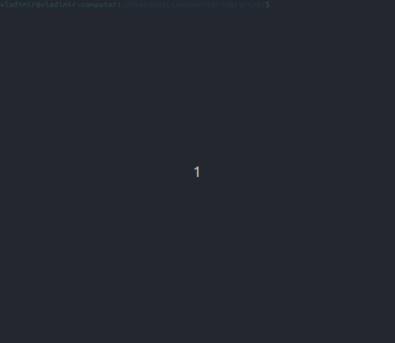

# LinuxMonitoring

## Content
1.[Information](#1-information)\
2.[Goals](#2-goals)\
3.[Example of using the scripts](#3-example-of-using-the-scripts)

## 1. Information
This project has developed basic bash scripts that allow you to explore the operating system and file system research.

## 2. Goals

- [x] Learn how to write scripts in bash.
- [x] Explore the linux file system.
- [x] Explore popular utilities like "awk"

## 3. Example of using the scripts

